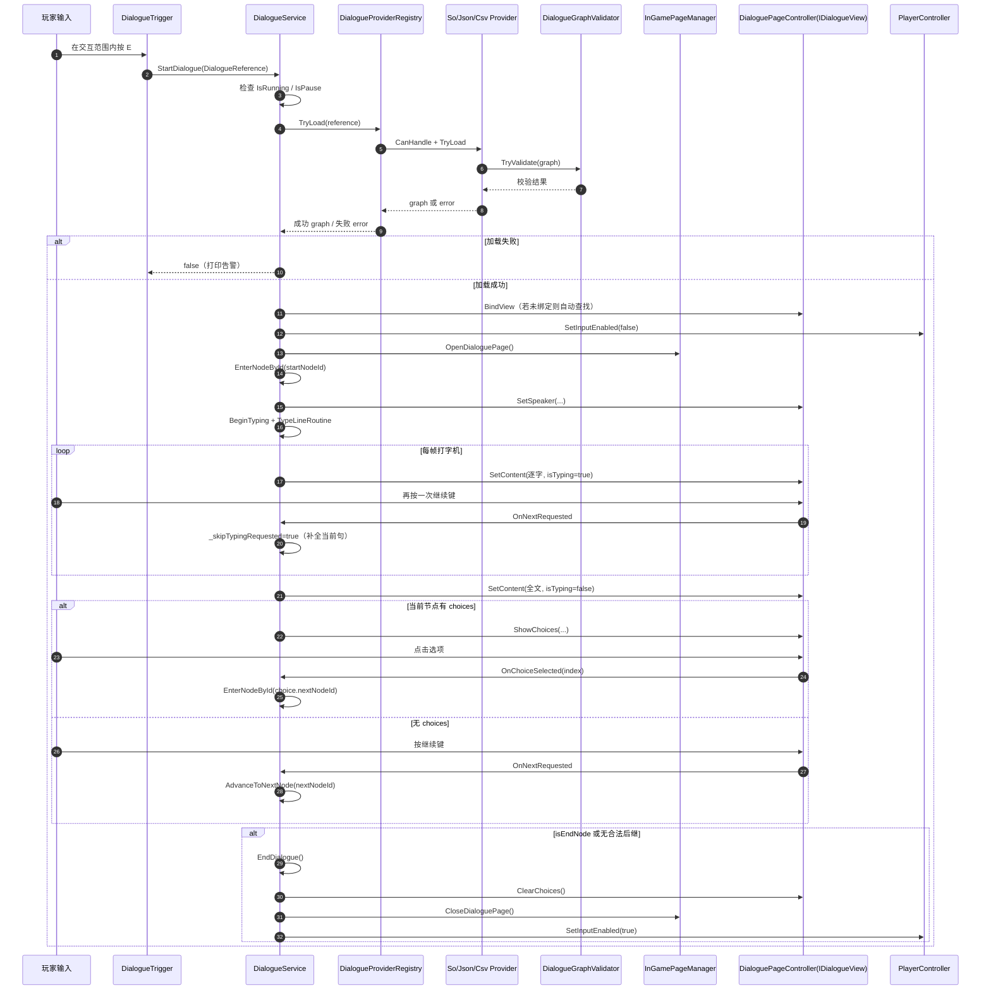
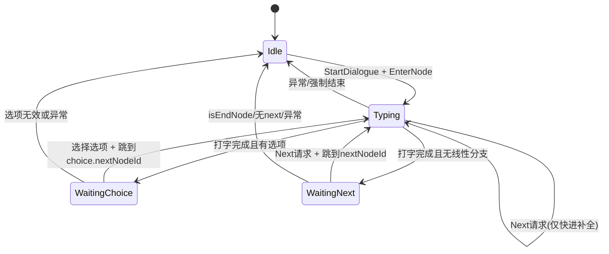

# 对话系统运行时序图（高清版）

> 说明：  
> 1. Mermaid 图适合在支持 Mermaid 的编辑器中查看（可缩放）。  
> 2. 下面还提供了“纯文本大图”，即使在终端里也能清晰阅读。  

---

## 1) 主流程时序图（Mermaid）



---

## 2) 运行状态图（Mermaid）



---

## 3) 纯文本大图（终端友好）

### 3.1 启动与加载链路

```text
[玩家按E]
    |
    v
[DialogueTrigger.Update]
  - oneShot已触发? 是 -> 返回
  - DialogueService正在运行? 是 -> 返回
  - 距离 > interactRange? 是 -> 返回
  - 否 -> 调用 StartDialogue(reference)
    |
    v
[DialogueService.StartDialogue(reference)]
  - 正在对话? 是 -> false
  - 当前暂停? 是 -> false
  - reference为空? 是 -> false + 日志
  - 否 -> ProviderRegistry.TryLoad(reference)
    |
    v
[DialogueProviderRegistry]
  - 按顺序找可处理Provider (SO -> JSON -> CSV)
  - Provider.TryLoad(...)
      - 构图 -> Validator.TryValidate(...)
  - 主来源失败且 fallbackSO存在?
      - 是 -> 再尝试 fallbackSO
  - 最终:
      - 成功 -> 返回 graph
      - 失败 -> 返回 error
```

### 3.2 运行与输入链路

```text
[StartDialogue(graph) 成功]
    |
    +--> EnsureView()
    |      - 已绑定IDialogueView: 通过
    |      - 否则场景内自动查找实现
    |      - 找不到: 失败+日志
    |
    +--> SetPlayerInputEnabled(false)
    +--> OpenDialoguePage()
    +--> EnterNodeById(startNodeId)
           |
           +--> SetSpeaker(...)
           +--> BeginTyping(content)
                  |
                  +--> TypeLineRoutine (每帧)
                         - 按Next且在Typing: 仅补全文字
                         - 打完后:
                             * 有choices -> WaitingChoice + ShowChoices
                             * 无choices -> WaitingNext
```

### 3.3 推进与结束链路

```text
[WaitingNext]
  玩家按下一步
    -> AdvanceToNextNode()
       - isEndNode=true -> EndDialogue
       - nextNodeId为空 -> EndDialogue(安全兜底)
       - 否则 -> EnterNodeById(nextNodeId)

[WaitingChoice]
  玩家点选项
    -> HandleChoiceSelected(index)
       - index非法 -> 日志并返回
       - choice无nextNodeId -> EndDialogue(安全兜底)
       - 否则 -> EnterNodeById(choice.nextNodeId)

[EndDialogue]
  - StopTypingCoroutine
  - ClearChoices
  - CloseDialoguePage
  - 恢复玩家输入
  - 清空运行时上下文
  - state = Idle
```

---

## 4) 脚本关联速查

```text
DialogueTrigger
  -> DialogueService.StartDialogue(reference)

DialogueService
  -> DialogueProviderRegistry.TryLoad(reference)
  -> InGamePageManager.Open/CloseDialoguePage
  <-> IDialogueView (事件双向)
  -> PlayerController.SetInputEnabled

DialogueProviderRegistry
  -> SoDialogueProvider / JsonDialogueProvider / CsvDialogueProvider
  -> fallbackSO 兜底

Provider
  -> 产出 DialogueGraph
  -> DialogueGraphValidator.TryValidate

DialoguePageController (IDialogueView)
  -> 接收 Service 的 SetSpeaker/SetContent/ShowChoices
  -> 回传 OnNextRequested / OnChoiceSelected

UIManager + InGamePageManager
  -> 处理暂停/背包热键
  -> 对话运行时屏蔽冲突输入
```

